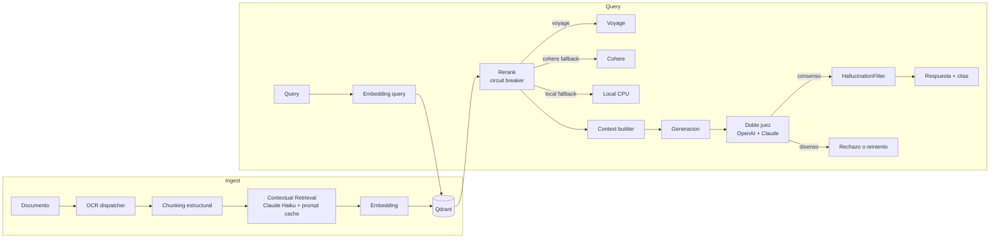

# rag-crag-reference

Reference implementation de un pipeline **RAG con CRAG (Corrective RAG) y doble
juez**, circuit breaker entre proveedores de reranking, y contextual retrieval
estilo Anthropic con prompt caching.

> Codigo sintetico, sin datos ni clientes reales. Ilustra los patrones que uso en
> sistemas RAG productivos. Ver [`portfolio`](https://github.com/jpfiguer/portfolio)
> para case studies con contexto de negocio.

## Que muestra

- **Circuit breaker per-provider** para rerankers (Voyage primario → Cohere → local
  como fallbacks). Cuenta fallos consecutivos, abre el circuito, hace probe para
  auto-healing
- **Doble juez OpenAI + Claude** para verificacion CRAG. Consenso → respuesta,
  disenso → rechazo o reintento con mas contexto
- **Contextual Retrieval estilo Anthropic**: LLM chico genera anclaje situacional
  por chunk antes de embedear, con **prompt caching** para ahorrar tokens
- **Chunking estructural** con page tracking (form-feed markers)
- **HallucinationFilter** con patterns regex + heuristica de citas
- **Eval pipeline** con Ragas + set de regresion

## Stack

- Python 3.12 · FastAPI · Pydantic v2 · structlog
- OpenAI · Anthropic · Voyage · Cohere
- Qdrant como vector db
- Docker + docker-compose
- pytest + respx para mocking

## Arquitectura



## Estructura

```
rag-crag-reference/
├── README.md
├── LICENSE (MIT)
├── pyproject.toml
├── .env.example
├── .gitignore
├── Dockerfile
├── docker-compose.yml
├── src/
│   ├── main.py                        FastAPI app
│   ├── config.py
│   ├── logging_setup.py
│   ├── rerank/
│   │   ├── circuit_breaker.py         patron core
│   │   ├── types.py
│   │   ├── service.py                 orchestrator
│   │   └── providers/
│   │       ├── voyage.py
│   │       ├── cohere.py
│   │       └── local.py
│   ├── ingest/
│   │   ├── chunking.py                estructural + page tracking
│   │   └── contextual_retrieval.py    con prompt caching
│   ├── generate/
│   │   ├── crag.py                    doble juez
│   │   └── hallucination_filter.py
│   └── eval/
│       └── ragas_runner.py
├── tests/
│   ├── test_circuit_breaker.py
│   ├── test_crag.py
│   └── test_hallucination_filter.py
└── .github/workflows/ci.yml
```

## Correr localmente

```bash
cp .env.example .env
docker compose up -d qdrant
pip install -e ".[dev]"
uvicorn src.main:app --reload
pytest
```

## Licencia

MIT — ver [LICENSE](LICENSE).
